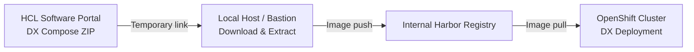

# HCL Digital Experience (DX) Compose – Image Mirroring to Harbor

## Executive Summary

Enterprise OpenShift and Kubernetes platforms commonly operate with **internal container registries** to enforce security, compliance, and operational control.  
Although HCL provides a publicly accessible registry for **HCL Digital Experience (DX)** images, many customers—especially those running in **restricted or air-gapped environments**—must mirror these images into their own registries.

This document describes a **simple and auditable workflow** to:
- Download HCL DX Compose container images as an offline archive
- Upload them into an **internal Harbor registry**
- Enable their consumption during platform deployments

Multiple mirroring strategies are briefly discussed, with guidance on when to use each one.  
The guide intentionally focuses on a **low-complexity, offline approach**, suitable for a wide range of customer environments, while still allowing future evolution toward automated mirroring solutions.

---

## Background / Context

Although **HCL provides a publicly accessible Harbor registry** that customers can use to automatically pull the container images required to deploy **HCL Digital Experience (DX)**, many enterprise environments rely on **internal container registries**.

This approach allows organizations to:

- Enforce **corporate security and compliance policies**
- Control image provenance and vulnerability scanning
- Operate in **restricted or fully air-gapped OpenShift environments**
- Reduce external network dependencies during cluster operations

In such scenarios, container images must be **mirrored from the vendor registry into a customer-managed registry**.

Several supported strategies exist to achieve this:

- **Transparent mirroring using oc-mirror / oc2mirror**, allowing a controlled and declarative mirror from external registries into internal ones.  
  This approach is well suited for **OpenShift environments** and can be combined with **registry replication mechanisms** to ensure **long-term maintenance and lifecycle management** of container images.
- **Direct registry-to-registry copy** using tools such as **skopeo**
- **Harbor replication rules**, when the customer also uses Harbor, to automatically mirror vendor images and keep them synchronized over time
- **Offline distribution**, by downloading images as an archive (ZIP) and uploading them into the internal registry

This guide focuses on the **offline distribution approach**, demonstrating how to download HCL DX Compose images as an archive and upload them into a **Harbor registry**.

---

## High-Level Flow (Mermaid)



---

## Workflow Overview

The process consists of:

1. Downloading **HCL DX Compose** from the HCL Software Portal  
2. Extracting the container images locally  
3. Uploading the images to an **internal Harbor registry**  
4. Consuming the images from the registry during deployment

The example used in this guide references **DX Compose version 9.5.2-232**.

---

## Step-by-Step Instructions

### 1. Access the Download Portal

Navigate to the official HCL Software download page for DX Compose:

```
https://my.hcltechsw.com/downloads/dx/compose
```

---

### 2. Select Version

Select the appropriate release version for your target environment.

In this example:
- **Major version:** 9.5  
- **Build:** 9.5.2-232  
- **Release date:** December 15, 2025

---

### 3. Generate the Download Link

Locate the archive:
- **File name:** `hcl-compose-kubernetes-CF232`
- **Size:** ~6.88 GB

Generate a **temporary, pre-authenticated URL** (valid for 60 minutes) using the *Copy temporary link* option.

---

### 4. Download the Archive

Download the archive to a bastion host or administrative node with network access.

```bash
wget -O hcl-cf232.zip "https://cdn.hcltechsw.com/hcl-compose-kubernetes-CF232.zip?Object=..."
```

> The URL shown above is truncated. Use the full temporary link generated in the previous step.

---

### 5. Extract the Images

Extract the archive into a working directory:

```bash
unzip hcl-cf232.zip -d images
```

This directory will contain the container images and metadata required for upload.

---

### 6. Upload Images to Harbor

Once the images are available locally, they can be uploaded **manually** to the internal registry using standard container tooling  
(e.g. **podman** or **skopeo**).

To simplify and automate this process, an **optional helper script** (`upload_harbor.sh`) is provided.  
This script iterates over the extracted images and performs the **load, tag, and push** operations automatically.

---

### 7. Optional: Upload Images Using the Helper Script

Example usage:

```bash
../upload_harbor.sh \
  p32810yz.gra7.container-registry.ovh.net \
  'robot$dx+dxuser' \
  XdNaDjuuTjUd3IphHESzfDaoX0IHCZ8F \
  dx
```

---

---

---

## Access and Prerequisites Note

Depending on the image distribution method selected, **different access requirements apply**:

- If you plan to use **online or registry-based methods** (such as oc-mirror, skopeo copy, or Harbor replication), the customer must have:
  - **Network access** to the HCL container registry
  - Valid **credentials for the HCL Harbor registry** located at:
    - https://hclcr.io/

- If you plan to use the **offline ZIP distribution method** described in this guide, the customer must have:
  - Access to the **MyHCL Software Portal**
  - Valid **MyHCL credentials** to download the DX Compose archive from:
    - https://my.hcltechsw.com/

The **official and detailed HCL procedure** for downloading and handling DX container images is documented at:

- https://help.hcl-software.com/digital-experience/9.5/CF232/get_started/download/harbor_container_registry/

This guide complements the official documentation by providing a **simplified, operational example** focused on customer-managed registries.


## Decision Guide: oc-mirror vs Offline ZIP

When choosing how to mirror HCL DX Compose images into an internal registry, the decision mainly depends on **environment connectivity, operational maturity, and long-term maintenance needs**.

### Use **oc-mirror / oc2mirror** when:

- You are running **OpenShift** and want a **declarative, supported mirroring workflow**
- The environment has **controlled but available access** to external registries (or via a bastion)
- You want **transparent image resolution** without changing deployment manifests
- **Long-term maintenance** is required, including:
  - Periodic updates
  - Consistent image lifecycle management
  - Integration with **registry replication** strategies
- The platform team is comfortable operating OpenShift-native tooling

**Recommended for:**  
Production platforms, regulated environments with structured operations, and clusters that require continuous updates.

---

### Use **Offline ZIP distribution** when:

- The environment is **fully air-gapped** or has **no outbound connectivity**
- Image transfer must be performed via **manual or controlled file exchange**
- The goal is a **one-time or infrequent deployment**
- Operational simplicity is preferred over automation
- The target audience includes **non-platform specialists**

**Recommended for:**  
Proof-of-concepts, isolated environments, initial bootstrap phases, or customer teams with limited OpenShift experience.

---

In this guide, the **Offline ZIP approach** is used as it provides a **simple, explicit, and easy-to-audit workflow**, while still allowing a future transition to oc-mirror or registry replication if needed.

## Security Considerations

- Treat robot tokens as **secrets**
- Avoid hardcoding credentials in scripts or repositories
- Prefer environment variables or secret management solutions
- Rotate credentials if exposure is suspected

---
